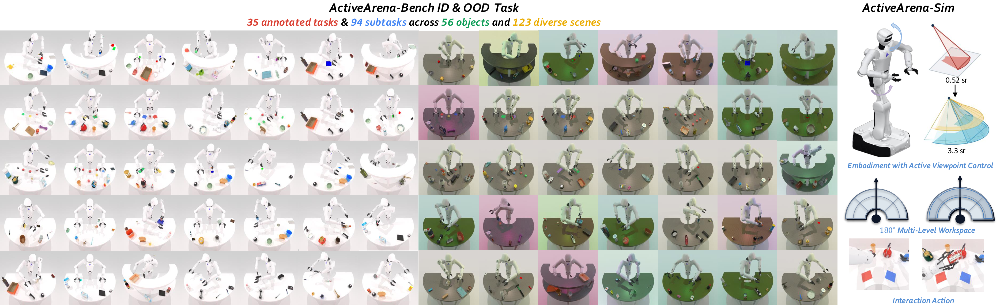

# ActiveArena

**Benchmarking and Understanding Active Perception in Robotic Manipulation**

ActiveArena is a simulation environment and benchmark for robotic manipulation that requires **actively acquiring visual evidence and remembering it across observations**. Robots must change viewpoints, search across a large workspace, or interact with objects to reveal information before completing a task.

[Project Website](https://leeibo.github.io/ActiveArena) · [Dataset](https://huggingface.co/datasets/leeibo/ActiveArena-Data) · [Simulation Assets](https://huggingface.co/datasets/leeibo/ActiveArena-Assets)

<p align="center">
  
</p>

<p align="center"><b>35 tasks · 2 task families · 5 categories · controllable viewpoints · ID/OOD evaluation</b></p>

## Overview

This repository provides the simulator, benchmark tasks, demonstration collection tools, process annotations, and fixed-seed evaluator.

- **ActiveArena-Sim:** an Astribot S1 embodiment with controllable head and torso, dual-arm manipulation, and large workspaces that require viewpoint changes.
- **ActiveArena-Bench:** 35 language-conditioned tasks covering visual exploration and interactive information acquisition.
- **Data and annotations:** demonstration collection with images, robot states, language instructions, and process-level annotations for studying perception, memory, and action.
- **Reproducible evaluation:** fixed task lists, scene configurations, evaluation seeds, and task success checks for in-distribution (ID) and out-of-distribution (OOD) evaluation.

## Benchmark

The initial observation is insufficient to solve the tasks. A policy must decide where to look, what evidence to retain, and when to act on that evidence. The benchmark uses an 18-dimensional action representation covering both arms, grippers, torso, and head.

| Category | Focus |
| --- | --- |
| **SS — Single-Object Search** | Locate a target and manipulate it. |
| **SL — Single-Object Loop** | Search across regions and transport one object. |
| **ML — Multi-Object Loop** | Complete multiple perception–action loops. |
| **MD — Multi-Object Decision** | Acquire evidence about candidates and compare them. |
| **IA — Interactive Information Acquisition** | Interact with the scene to reveal hidden information. |

<p align="center">
  
</p>

The benchmark training protocol uses **100 ID demonstrations per task**, totaling **581.2k frames / 10.76 hours**. Evaluation uses **50 episodes per task in each setting**. The released task list is in [task_config/eval_seed_task_whitelist.yml](task_config/eval_seed_task_whitelist.yml).

## Installation

### Environment

Use Linux with Python 3.10, an NVIDIA GPU, a CUDA toolkit compatible with the pinned PyTorch build, Vulkan rendering, and `ffmpeg`.

```bash
git clone https://github.com/leeibo/ActiveArena.git
cd ActiveArena

sudo apt-get update
sudo apt-get install -y git curl unzip ffmpeg libvulkan1 mesa-vulkan-drivers vulkan-tools \
  libx11-6 libxext6 libxrender1 libxfixes3 libxrandr2 libxi6 build-essential

conda env create -f environment.yml
conda activate activearena-sim
bash script/_install.sh
python -c "import torch, sapien, mplib, curobo, yaml, h5py; print('ActiveArena imports OK')"
```

The installer builds pinned versions of PyTorch3D and cuRobo. A CUDA toolkit containing `nvcc` is required; set `CUDA_HOME` to its directory if it is installed outside the conda environment. Package versions are recorded in [script/requirements.txt](script/requirements.txt), with source revisions in [docs/UPSTREAM_SNAPSHOTS.md](docs/UPSTREAM_SNAPSHOTS.md).

### Simulation assets

Download the base simulation assets and the ActiveArena additions:

```bash
bash script/_download_assets.sh
python script/download_activearena_assets.py
```

The first command downloads the pinned RoboTwin2.0 base archives. The second installs the button object and Astribot embodiment from [ActiveArena-Assets](https://huggingface.co/datasets/leeibo/ActiveArena-Assets), verifying their checksums. Both commands validate archive layouts and support retries.

```text
assets/
├── background_texture/
├── objects/005_button/
└── embodiments/astribot_descriptions_texture/
```

If you move the repository, rerun `python script/download_activearena_assets.py` to update absolute URDF and collision paths.

## Collect demonstrations

Run a task with the demonstration scene configuration:

```bash
bash collect_data.sh count_target_press_button info_gathering_demo 0
```

The arguments are **task name**, **task configuration**, and **GPU ID**. To collect with randomized scenes:

```bash
bash collect_data.sh count_target_press_button info_gathering_randomized 0
```

Configure collection through [task_config/info_gathering_demo.yml](task_config/info_gathering_demo.yml) or [task_config/info_gathering_randomized.yml](task_config/info_gathering_randomized.yml). Set `episode_num` to the desired number of demonstrations; camera, observation, and domain-randomization options are defined in the same files.

Outputs are stored under `data/<task>/<config>__<difficulty_tag>/`, including HDF5 trajectories, videos, scene metadata, and episode instructions. Keep training demonstrations separate from the fixed evaluation episodes.

### Released dataset

The demonstration dataset is available in LeRobot format from [ActiveArena-Data](https://huggingface.co/datasets/leeibo/ActiveArena-Data):

```bash
huggingface-cli download leeibo/ActiveArena-Data \
  --repo-type dataset \
  --local-dir data/ActiveArena-Data
```

This is the converted training dataset. Raw HDF5 trajectories can be generated with the collection commands above. Large datasets and simulation assets are distributed separately from the code repository.

## Evaluation

### Protocol

| Setting | Task configuration | Scene variation |
| --- | --- | --- |
| ID | `info_gathering_demo` | Demonstration-domain scenes with held-out evaluation seeds. |
| OOD | `info_gathering_randomized` | Randomized backgrounds, lighting, table height, and a broader distractor pool. |

Each setting contains seed files for all 35 benchmark tasks in [eval_seed_lists/](eval_seed_lists/). Each task file stores **100 ordered, unique valid seeds**; the benchmark protocol evaluates the **first 50 entries**. Run every selected episode, count unsuccessful policy episodes as failures, and report per-task success rates and their mean across the 35 tasks separately for ID and OOD.

### Evaluate your own policy

The evaluator in [script/eval_policy.py](script/eval_policy.py) loads a policy module from `policy/`. To integrate a policy, create `policy/my_policy/` and export these functions from its `__init__.py`:

| Function | Responsibility |
| --- | --- |
| `get_model(usr_args)` | Load the policy or connect to its inference server. |
| `reset_model(model)` | Reset policy state and memory before each episode. |
| `eval(TASK_ENV, model, observation)` | Predict and execute actions through `TASK_ENV.take_action(...)`. |

The evaluator supplies observations from `TASK_ENV.get_obs()`; the episode instruction is available through `TASK_ENV.get_instruction()`. The adapter handles observation preprocessing and conversion to the simulator's action layout. See [envs/_base_task.py](envs/_base_task.py) for the environment interface.

After implementing the adapter, create `policy/my_policy/deploy_policy.yml` with the evaluation fields below and any additional settings required by your model:

```yaml
policy_name: my_policy
task_name: count_target_press_button
task_config: info_gathering_demo
ckpt_setting: my_checkpoint
seed: 0
instruction_type: unseen
test_num: 50
use_eval_seed_list: true
```

Run from the ActiveArena repository root with the simulator environment active:

```bash
CUDA_VISIBLE_DEVICES=0 python script/eval_policy.py \
  --config policy/my_policy/deploy_policy.yml
```

Use `--overrides --test_num 1` for a one-episode smoke run. For OOD evaluation, use `--overrides --task_config info_gathering_randomized`. Run each task in the benchmark task list for a complete evaluation. `use_eval_seed_list: true` selects the committed seeds for the chosen task and configuration.

Results and rollout videos are written under `eval_result/<task>/<policy>/<task_config>/<ckpt_setting>/<timestamp>/` by default.

### Optional baselines

[ActiveArena-VLA](https://github.com/leeibo/ActiveArena-VLA) provides reference policies, training recipes, and pretrained checkpoints. For those baselines, see the [reproduction guide](docs/reproduction.md) and [multi-GPU evaluation launcher guide](ACTIVEARENA_EVAL_LAUNCH.md).

## Repository structure

```text
ActiveArena/
├── envs/                  # Simulator, task implementations, and success checks
├── task_config/           # Scene, camera, embodiment, and benchmark task configs
├── eval_seed_lists/       # Fixed ID/OOD evaluation seeds
├── description/           # Language templates and instruction generation
├── script/                # Installation, assets, collection, and evaluation tools
├── policy/                # Policy adapters
├── assets/                # Asset download utilities and installed simulation assets
├── docs/                  # Benchmark figures and supporting documentation
├── collect_data.sh        # Demonstration collection entry point
└── environment.yml        # Simulator environment
```

## Acknowledgements and license

ActiveArena builds on [RoboTwin](https://github.com/RoboTwin-Platform/RoboTwin) for simulation and manipulation infrastructure, and uses articulated information-gathering assets from [RMBench](https://github.com/RoboTwin-Platform/RMBench). The reference policy adapters build on [StarVLA](https://github.com/starVLA/starVLA).

The code is released under the [MIT License](LICENSE). Third-party code and assets retain their respective licenses and attribution requirements.

## Citation

If you use ActiveArena in your research, please cite the project. The following is a temporary manuscript entry; verified author and publication metadata will be added when available.

```bibtex
@misc{activearena_manuscript,
  title = {ActiveArena: Benchmarking and Understanding Active Perception in Robotic Manipulation},
  note  = {Manuscript submitted for review at AAAI 2027}
}
```

Contributions and bug reports are welcome through the [issue tracker](https://github.com/leeibo/ActiveArena/issues).
